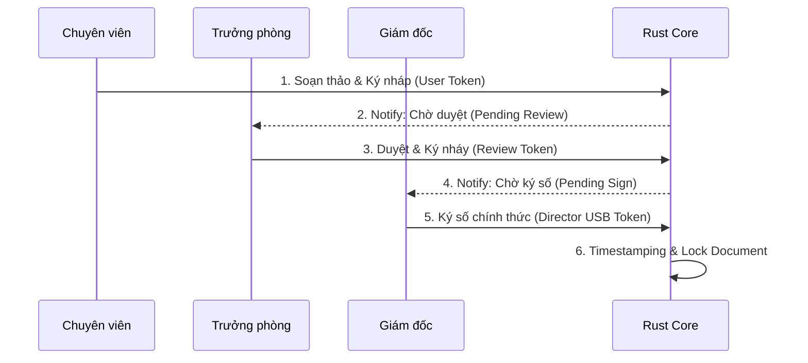

# TeraChat Enterprise OS — Technical Specification v2.0

> **Phiên bản:** V0.2.1 Alpha | **Kiến trúc:** Desktop-First, Federated Clusters | **Mục tiêu:** Bảo mật & Hiệu năng Doanh nghiệp

---

## 1. Kiến trúc Hệ thống

### 1.1 Federated Private Clusters

Kiến trúc Cluster thay thế VPS đơn lẻ (Single Point of Failure):

- **Encryption:** Toàn bộ Payload được mã hóa bằng `Company_Key` trước khi rời thiết bị.
- **Storage:** Cluster gồm 3–5 Nodes chạy **Erasure Coding** (Sharding dữ liệu). Nếu 1 Node sập, dữ liệu tự phục hồi từ các mảnh còn lại.
- **Routing:** Client kết nối trực tiếp tới IP của Company Cluster, không đi qua Cloud công cộng.

**Identity Onboarding (Quản trị tập trung):**

- **Admin Action:** Nhập Email → Server gửi **Invite Token** (Signed JWT) qua Email.
- **User Action:** Click Link → App dùng Private Key ký Token → Hệ thống tự động **Bind** thiết bị vào định danh công ty.
- **Auto-Sync:** Tự động add nhân viên vào nhóm dựa trên thông tin từ Azure AD/LDAP.
- **Identity Lock:** Tên hiển thị bị khóa theo danh tính doanh nghiệp, user không được tự đổi.

**Cluster Scope — Hạ tầng 4-trong-1:**

| Thành phần | Chức năng |
|---|---|
| **MLS Backbone** | Phân phối khóa & định tuyến tin nhắn cho nhóm 5000+ người. Lưu trữ Encrypted Log Streams (Zero-Knowledge). |
| **HA TURN Cluster** | Floating IP, tự động Failover trong 3s. Chịu tải hàng nghìn cuộc gọi HD/Video Conference. |
| **Execution Environment** | Thực thi backend cho Mini-Apps nội bộ, dữ liệu P2P chỉ nằm trên RAM. |
| **Interop Hub** | Gateway mã hóa dữ liệu từ SAP/Jira/CRM chuẩn E2EE trước khi đẩy xuống Client. |

**Deployment Models (Reseller Ready):**

| Model | Đối tượng | Hạ tầng | Quản trị |
|---|---|---|---|
| **Managed SaaS** | Nhà hàng, SME (Non-Tech) | TeraChat Cloud (AWS/GCP) | TeraChat quản lý hạ tầng. Admin công ty chỉ quản lý User. |
| **On-Premise** | Bank, Gov, Large Enterprise | Private Server (Vật lý/VMware) | IT doanh nghiệp tự quản lý (Helm Chart). Data Sovereignty 100%. |


### 1.2 Architecture V2 — Refactor Manifest

| Thành phần | Specification |
|---|---|
| **Client Engine** | Rust + Tauri (Desktop Central) |
| **Đồng bộ (Sync)** | Encrypted Mailbox (Store-and-Forward) + CRDT Merge |
| **Hạ tầng (Infra)** | Federated Clusters — Cụm 3–5 node tự cân bằng tải |
| **Crypto & Privacy** | Post-Quantum (Kyber/Dilithium) + Sealed Sender |
| **AI Integration** | API AI Gateway (BYOK) — OpenAI/Claude/Azure qua Middleware |

### 1.3 Chiến lược Định tuyến: "Vùng Chiến Thuật"

> **Nguyên lý:** Không chặn người dùng, mà **phân luồng** họ vào đúng vùng hạ tầng phù hợp.

| Vùng | Tên mã | Đối tượng | Hạ tầng | Quy tắc chính |
|---|---|---|---|---|
| **Vùng 1** | "Pháo Đài Số" (Intranet) | Nhân viên nội bộ | Private Cluster của Doanh nghiệp | Chỉ `Org_ID` hợp lệ mới được vào. Dữ liệu **không bao giờ** rời khỏi Cluster. |
| **Vùng 2** | "Cổng Hải Quan" (Federation) | Sale, CSKH làm việc với khách hàng bên ngoài | Cluster DN + Module **Inter-org Federation** | Audit Log **BẮT BUỘC**. Nhân viên nghỉ việc → mất quyền, dữ liệu KH ở lại công ty. |

**Tính năng theo Vùng:**

| Tính năng | Vùng 1 (Nội bộ) | Vùng 2 (Đối ngoại) |
|---|---|---|
| Chat mật | ✅ | ✅ (Audit) |
| Smart Approval | ✅ | ❌ |
| Gửi file nội bộ | ✅ | ✅ (DLP) |
| Magic Logger (AI Import) | ✅ | ✅ (Section 5.9) |
| Giao thức "Mời vào nhà" | ❌ | ❌ |

> [!WARNING]
> **Enterprise Only:** TeraChat là nền tảng dành riêng cho doanh nghiệp. Không hỗ trợ chế độ "Personal Mode" hoặc kết nối VPS cá nhân. Nhân viên Sale/CSKH **BẮT BUỘC** dùng Vùng 2 (Federation) để đảm bảo Audit Log.

---

### 1.4 UI/UX Philosophy: "Data Density" (Productivity First)

> **CEO Directive:** TeraChat không phải là mạng xã hội. Nó là **công cụ lao động** (Operating System for Work).

**Core Principles:**

1.  **No Chat Bubbles:**
    *   Loại bỏ giao diện "bong bóng chat" (Facebook/Zalo style) tốn diện tích.
    *   Sử dụng giao diện **List View** (Slack/Discord/Terminal style) để hiển thị tối đa thông tin trên màn hình.
    *   Avatar nhỏ (24px), Tên người gửi Highlight màu, Timestamp rõ ràng.
*   **Target:** Hiển thị 20 dòng tin nhắn trên màn hình 13 inch (so với 8 dòng của Zalo).

2.  **Command Palette (`Cmd+K`):**
    *   Điều hướng không dùng chuột (Keyboard-centric).
    *   Gõ `/` để gọi lệnh (Slash Commands): `/sign` (Trình ký), `/approve` (Duyệt chi), `/pos` (Mở máy bán hàng).

3.  **App-in-Chat (Adaptive Widgets):**
    *   Không pop-up cửa sổ mới.
    *   Các Mini-App (Form duyệt, Báo cáo tồn kho) hiển thị trực tiếp dưới dạng **Collapsible Card** ngay trong dòng chat.


## 2. Security Engine

### 2.1 Key Hierarchy Management (HKMS)

**Key Ratchet Rotation:** Khi Admin bấm Revoke, Server phát lệnh Epoch Rotation. Khóa giải mã cũ bị hủy hiệu lực.

**Dead Man Switch (Hardware-Backed):**

- **Monotonic Counter:** Sử dụng Hardware Counter (iOS: Secure Enclave Counter, Android: StrongBox) thay vì đồng hồ hệ thống để chống Time Travel Attack.
- **Mechanism:** Mỗi lần unlock DB → Counter++. Server lưu "Last Valid Counter Value" cho mỗi device.
- **Verification:** Khi online, Client gửi Counter hiện tại lên Server. Nếu Counter < Server's Value → Device đã bị revert/clone → Từ chối và trigger Self-Destruct.
- **Offline Grace Period:** Client hoạt động offline tối đa 72h. Sau đó bắt buộc online 1 lần để verify counter.

**Remote Wipe — MLS Protocol Implementation:**

1. **Event Listener:** App lắng nghe `onEpochChanged`. Nếu `self.userID` nằm trong `removedMembers`...
2. **Poison Pill (Tự hủy):**
   - `KeyStore.deleteKeys()`: Xóa Private Key trong Secure Enclave → Dữ liệu thành rác.
   - `WatermelonDB.unsafeResetDatabase()`: Drop bảng chat.
   - `FileSystem`: Quét và xóa file Sandbox.
3. **Constraint:** Thực thi trong `autoreleasepool` (iOS) hoặc `try-finally` (Android) để đảm bảo không thể bị chặn bởi User.

### 2.2 Crypto-Shredding

Trên SSD/NVMe hiện đại, overwrite data **VÔ HIỆU QUẢ** do Wear Leveling. Giải pháp: Crypto-Shredding — Xóa khóa giải mã thay vì xóa dữ liệu.

| Lớp Bảo Mật | Implementation |
|---|---|
| **Data Layer** | Toàn bộ DB mã hóa bằng **DEK** (256-bit AES-GCM) — random unique key cho mỗi DB instance. |
| **Key Layer** | DEK được wrap bằng **KEK** (Key Encryption Key), derive từ Master Key trong Secure Enclave/TPM. |
| **Master Key** | Nằm trong Hardware Security Module (Secure Enclave/StrongBox). **KHÔNG BAO GIỜ** rời khỏi chip. |
| **Shredding Process** | 1. Xóa KEK từ Secure Enclave → DEK không thể decrypt → DB = garbage data → Vĩnh viễn không đọc được (cryptographically erased). |

```swift
// Swift (iOS) - Crypto-Shredding Implementation
func secureDataDestruction() {
    // 1. Delete KEK from Secure Enclave
    let query: [String: Any] = [
        kSecClass as String: kSecClassKey,
        kSecAttrApplicationTag as String: "com.terachat.kek"
    ]
    SecItemDelete(query as CFDictionary)
    
    // 2. Zero out any cached DEK in RAM
    memset_s(&dek, dek.count, 0, dek.count)
}
```

**Best Practices:**

- **KEK Rotation:** Rotate mỗi 30 ngày. Re-encrypt DEK với KEK mới.
- **RAM Pinning:** Sử dụng `mlock()` để prevent DEK bị swap xuống disk.
- **Full Disk Encryption:** Bắt buộc BitLocker/FileVault làm lớp phòng thủ cuối cùng.
- **Audit Logging:** Log mọi KEK deletion event (tamper-proof, write-only log).

### 2.3 Ephemeral Memory & Swap Defense

**A. RAM Pinning (Chống Swap)**

Sử dụng **Memory Locking** để ghim các trang nhớ nhạy cảm:

- Linux/macOS: `mlock()` hoặc `mlockall()`
- Windows: `VirtualLock()`

```rust
// Rust (cross-platform)
libc::mlock(ptr as *const c_void, size);
// Windows: kernel32::VirtualLock(ptr, size);
```

**B. Encrypted Swap Policy**

- **MDM Policy:** TeraChat Client kiểm tra trạng thái mã hóa ổ đĩa khi khởi động.
- **Yêu cầu bắt buộc:** Nếu phát hiện thiết bị không bật **BitLocker** (Windows) hoặc **FileVault** (macOS), ứng dụng từ chối khởi chạy.

### 2.4 Hardware-Backed Signing

Hệ thống chia 2 thế giới tách biệt:

- **App Land (Untrusted):** CPU/RAM thường — nơi ứng dụng chạy.
- **The Fortress (Trusted):** Chip bảo mật vật lý (Secure Enclave/Titan M). Private Key nằm tại đây và KHÔNG BAO GIỜ ra ngoài.

**Quy trình ký:**

1. App tạo Unsigned Payload (Binary).
2. App gọi System API (TPM/Secure Enclave). OS yêu cầu xác thực.
3. Quét vân tay TouchID hoặc Windows Hello → Mở khóa Hardware Chip.
4. Gói tin được đẩy VÀO Chip → Ký bằng Private Key → Đẩy RA `Signature`.

**Seed Phrase Import:**

- **Secure Input:** Ô nhập có cờ `secureTextEntry` (chặn keylogger/screenshot).
- **Wrapping:** Enclave tạo Master Key nội bộ → Mã hóa 12 từ khóa thành `Encrypted_Seed` → Lưu vào bộ nhớ máy.
- **Unwrapping:** Khi cần dùng, Enclave giải mã trong RAM kín → Derive Key → Ký → Wipe RAM ngay lập tức.

**Implementation Guide — BiometricSigner:**

| macOS (Swift/Rust Bridge) | Windows (Rust/C++) |
|---|---|
| `CryptoTokenKit` (SmartCard API) | `CNG (Cryptography Next Gen)` |
| Key Type: `kSecAttrTokenIDSecureEnclave` | Provider: `Microsoft Platform Crypto Provider` (TPM) |
| Access: `SecAccessControlCreateWithFlags(..., .userPresence)` | Auth: `NCryptSignHash` + UI Context |

**Gov-Grade Signing (USB Token/SmartCard):**

> **Requirement:** Khối Nhà nước/Hành chính công bắt buộc sử dụng **USB Token** (VNPT/Viettel CA) để ký văn bản pháp lý.

- **Standard:** PKCS#11 Interface.
- **Integration:** Rust Core gọi qua thư viện `pkcs11` crate.
- **Support:**
    - **Windows:** Tự động detect driver của Token (SafeNet, Viettel, VNPT).
    - **macOS:** Hỗ trợ TokenKit.


### 2.5 WYSIWYS Defense (What You See Is What You Sign)

Lỗ hổng: Secure Enclave chỉ ký Hash "mù" mà không biết Hash đại diện cho nội dung gì.

**Attack Vectors:**

- **UI Redressing (Overlay Attack):** Malware vẽ lớp trong suốt đè lên UI thật.
- **Function Hooking (Frida):** Hook `renderApprovalDetails()` để hiển thị giả, hook `preparePayload()` để tráo dữ liệu thật.

**Defense-in-Depth:**

**Solution 1: System-Managed Trusted UI**

Nhúng thông tin giao dịch vào Biometric Prompt của OS. Malware không thể vẽ đè lên System Prompt (Sandbox và Z-order protection).

```kotlin
// Android - BiometricPrompt
val promptInfo = BiometricPrompt.PromptInfo.Builder()
    .setTitle("Xác thực Phê duyệt")
    .setSubtitle("Duyệt chi Doanh nghiệp")
    .setDescription("LỆNH: Duyệt chi ${payload.amount} USD\nCHO: ${payload.recipientName}\nMÃ ĐƠN: ${payload.referenceId}")
    .setConfirmationRequired(true)
    .build()

biometricPrompt.authenticate(promptInfo, BiometricPrompt.CryptoObject(signature))
```

```swift
// iOS - LAContext
let reason = "Phê duyệt chuyển khoản: \(amount) tới \(recipient)"
guard let signature = SecKeyCreateSignature(
    privateKey,
    .ecdsaSignatureMessageX962SHA256,
    payload as CFData,
    &error
) as Data? else { throw error!.takeRetainedValue() as Error }
```

**Solution 2: Visual Challenge-Response**

- Yêu cầu nhập **Mã đơn hàng + số tiền** (không dùng nút Yes/No).
- Bàn phím hiển thị **Randomized Layout** (vị trí số thay đổi mỗi lần).

**Solution 3: Structured Approval Signing**

Dữ liệu phê duyệt được phân rã thành cấu trúc rõ ràng (Approver, Recipient, Amount, Reference) để hệ thống có thể parse và hiển thị đầy đủ trước khi ký xác nhận.

**Trusted Path Architecture (Z-Order Protection):**

| OS | API Implementation | Cơ chế Bảo vệ |
|---|---|---|
| **Android** | `BiometricPrompt.setDescription()` | Inject chuỗi giao dịch vào hộp thoại hệ thống. Yêu cầu Key có `setUserAuthenticationRequired(true)`. |
| **iOS** | `LAContext.localizedReason` | Hiển thị context trên FaceID Dialog. Key với cờ `.biometryCurrentSet` và `.privateKeyUsage`. |

**Critical Fallback:** Nếu OS không hỗ trợ hiển thị đủ thông tin, kích hoạt **Out-of-Band Verification**: nhập lại Mã đơn hàng vào **Randomized Keyboard**.

**Enterprise Security Checklist:**

- **Anti-Overlay Detection:** Quét liên tục Floating Windows. Phát hiện `SYSTEM_ALERT_WINDOW` → Vô hiệu hóa Smart Approval, fallback Password.
- **Screenshot Protection:** Set `FLAG_SECURE` (Android).
- **Server-Side Verification:** Relay Server verify: `Recover(Signature, Hash(PlainData)) == User_Public_Key`.

### 2.6 Remote Attestation (Zero-Trust Endpoint)

Server từ chối cấp phát Key nếu thiết bị không chứng minh được Hardware Integrity.

**RASP Limitation:** RASP chạy ở User Mode (Ring 3) — Hacker chiếm Kernel (Ring 0) có thể hook hàm `open()` để che giấu Root.

**Remote Attestation Flow:**

1. **Challenge:** Server gửi `nonce` ngẫu nhiên xuống Client.
2. **Attestation:** Client yêu cầu Chip bảo mật tạo "Health Quote" chứa: `nonce` + Trạng thái Boot (Secure Boot ON/OFF) + Chữ ký số của Chip.
3. **Verification:** Client gửi Quote lên Server → Server verify chữ ký với Vendor CA → Cấp Session Token.

**OS-Specific Implementation:**

| Platform | Native API | Cơ chế |
|---|---|---|
| **iOS** | `DCAppAttestService` | Verify App gốc (không Mod) và chạy trên iPhone thật (không Jailbreak). |
| **Android** | `Play Integrity API` | Yêu cầu `MEETS_STRONG_INTEGRITY` (Hardware-backed Keystore, chặn Emulator/Root). |
| **Windows** | `TPM 2.0 Health Attestation` | Kiểm tra PCR đảm bảo Kernel chưa bị tamper + BitLocker đang bật. |

```kotlin
// Android: Play Integrity
val integrityManager = IntegrityManagerFactory.create(context)
val tokenResponse = integrityManager.requestIntegrityToken(
    IntegrityTokenRequest.builder()
        .setNonce(serverNonce)
        .build()
).await()

// Server Verify - Payload phải đạt:
// "deviceRecognitionVerdict": ["MEETS_STRONG_INTEGRITY"]
// "appRecognitionVerdict": "PLAY_RECOGNIZED"
```

**Policy:** Nếu chỉ đạt `MEETS_BASIC_INTEGRITY` hoặc phát hiện Root → Server từ chối Handshake và gửi lệnh **Remote Wipe**.

### 2.7 Binary Hardening & Obfuscation

**Obfuscation Strategy (O-LLVM):**

| Kỹ thuật | Cơ chế | Mục tiêu |
|---|---|---|
| **Control Flow Flattening** | Biến `if-else/loop` thành vòng lặp `switch` phẳng. | Phá vỡ CFG trong IDA Pro/Ghidra. |
| **Bogus Control Flow** | Chèn mã giả không bao giờ thực thi. | Làm nhiễu phân tích tĩnh. |
| **Instruction Substitution** | Thay `a + b` bằng `a - (-b) + x - x`. | Làm rối Decompiler. |

**Secrets Protection (Compile-time XOR):**

- **String Encryption:** Mọi chuỗi tĩnh được mã hóa XOR với key ngẫu nhiên tại thời điểm biên dịch.
- **Stack Decryption:** Chuỗi chỉ giải mã trên Stack trước khi dùng và bị Zeroized ngay sau đó.

```rust
// Rust: String Obfuscation (obfstr crate)
use obfstr::obfstr;

fn verify_license() {
    let endpoint = obfstr!("https://auth.terachat.internal/verify");
    if check_server(endpoint) {
        println!("{}", obfstr!("Access Granted"));
    } else {
        println!("{}", obfstr!("Error: 0x99"));
    }
}
```

**Tamper Detection (Self-Checksumming):** App tự tính Hash của `.text section` khi khởi chạy. Nếu phát hiện Hash thay đổi → Kích hoạt **Silent Crash** (treo ngẫu nhiên) thay vì thông báo lỗi.

### 2.8 Continuous Fuzzing Infrastructure

**Coverage-Guided Fuzzing:**

| Target Component | Fuzzing Strategy | Mục tiêu phát hiện |
|---|---|---|
| **Packet Parser** (Protobuf/Binary) | Structure-Aware Fuzzing (LibFuzzer) | Buffer Overflow, Integer Overflow, Infinite Loops (DoS). |
| **Crypto Handshake** (Noise/MLS) | Stateful Fuzzing | Sai thứ tự gói tin → Deadlock hoặc bypass xác thực. |
| **File Processing** (Image/Docs) | File Format Mutation (AFL++) | Memory Corruption khi xử lý file đính kèm độc hại. |

**CI/CD Integration:**

- **Smoke Fuzz (PR Gate):** Mọi PR sửa Core Logic phải vượt qua 10 phút Fuzzing. Nếu Crash → Block Merge.
- **Deep Fuzz (Nightly):** Server chuyên dụng chạy Fuzzer 24h/ngày trên nhánh `main`.
- **LLVM Sanitizers:**
  - `AddressSanitizer (ASan)`: Buffer Overflow, Use-after-free.
  - `MemorySanitizer (MSan)`: Biến chưa khởi tạo.
  - `UBSan`: Tràn số, chia cho 0.

```rust
// Rust Fuzz Target (cargo-fuzz + libFuzzer)
#![no_main]
use libfuzzer_sys::fuzz_target;
use terachat_core::protocol::parse_packet;

fuzz_target!(|data: &[u8]| {
    if let Ok(packet) = parse_packet(data) {
        let _encoded = packet.to_bytes(); // Round-trip test
    }
});
```

**Zero-Trust Policy:** Bất kỳ thư viện bên thứ 3 nào **BẮT BUỘC** phải được Fuzzing độc lập trước khi tích hợp vào TeraChat Core.

### 2.9 Formal Verification (Z3 SMT Solver)

**Methodology: Invariant-Based Safety**

| Loại Bất biến | Logic |
|---|---|
| **Budget Integrity** | `assert(Org.approved_total <= Org.budget_limit)` — Tổng duyệt chi không bao giờ vượt ngân sách. |
| **Access Control** | `forall state: approve() => user.role in ["CFO", "CEO"]` — Chỉ cấp có thẩm quyền mới được duyệt. |
| **Monotonicity** | `nonce_new > nonce_old` — Số thứ tự chỉ tăng, không giảm (chống Replay). |

**Implementation: Z3 Model Checking**

```smt2
// SMT-LIB Model (Z3 Prover)
(declare-const balance_old Int)
(declare-const amount Int)
(declare-const balance_new Int)

(assert (>= balance_old amount))              ; require condition
(assert (= balance_new (- balance_old amount))) ; logic
(assert (< balance_new 0))                     ; Attack: Can balance go negative?

(check-sat)
; UNSAT = Không tìm được cách hack → AN TOÀN
; SAT   = Z3 trả về giá trị cụ thể → FIX NGAY
```

**CI/CD Pipeline:** Security Logic Pipeline tự động dịch OPA Policy + Approval Logic → SMT Model → Chạy Z3 Solver. Nếu tìm thấy kẽ hở → **Block Deploy**.

---

## 3. Identity & Access

### 3.1 Enterprise Identity (Federated PKI)

Tích hợp SSO (Azure AD/Okta/Google Workspace) với bảo mật E2EE. Zero-Touch Provisioning cho doanh nghiệp 5,000+ nhân viên.

**Architecture:**

- **Identity Broker (Keycloak/Dex):** Cầu nối OIDC/SAML giữa TeraChat và **đa nguồn IdP** (Azure AD, Google Workspace, Slack Enterprise, Okta, OneLogin).
- **Enterprise CA:** PKI nội bộ. Chỉ tin tưởng Key được ký bởi CA doanh nghiệp.
- **SCIM Listener:** Service lắng nghe sự kiện nhân sự từ **bất kỳ nguồn nào hỗ trợ SCIM 2.0** (Azure AD, Okta, Slack Enterprise, Google Workspace Enterprise).

**Database Schema (PostgreSQL for SCIM Store):**

```sql
-- 1. Users (Multi-Source — hỗ trợ Azure AD, Slack, Google, HR tùy biến)
CREATE TABLE enterprise_users (
    internal_id UUID PRIMARY KEY,
    external_id VARCHAR(255) UNIQUE, -- ID từ nguồn gốc (Azure Object ID, Slack Member ID, v.v.)
    source_provider VARCHAR(50) DEFAULT 'azure_ad', -- Nguồn: 'azure_ad', 'slack', 'google', 'custom_hr'
    source_metadata JSONB DEFAULT '{}', -- Raw data từ nguồn để debug/audit
    email VARCHAR(255) UNIQUE NOT NULL,
    active BOOLEAN DEFAULT TRUE, -- Kill Switch State
    attributes JSONB DEFAULT '{}', -- Dept, Title for ABAC
    created_at TIMESTAMPTZ DEFAULT NOW()
);

-- Index: Query nhanh theo nguồn
CREATE INDEX idx_user_source ON enterprise_users(source_provider, external_id);

-- 2. Certificate Binding
CREATE TABLE pki_bindings (
    binding_id UUID PRIMARY KEY,
    user_id UUID REFERENCES enterprise_users(internal_id),
    device_public_key TEXT NOT NULL, -- User's Ed25519 Key
    certificate_body TEXT NOT NULL, -- Signed by Enterprise CA
    revoked BOOLEAN DEFAULT FALSE,
    expires_at TIMESTAMPTZ NOT NULL
);

-- Trigger: Auto-Revoke when HR deactivates user
CREATE TRIGGER trg_auto_revoke 
AFTER UPDATE OF active ON enterprise_users
FOR EACH ROW EXECUTE FUNCTION auto_revoke_on_terminate();
```

**Data Flow — Binding Process:**

```
[USER DEVICE]                          [ADMIN SERVER]
     |                                        |
1. Gen Key (Pub/Priv)                         |
     |                                        |
     | <------- 2. Email (Invite Link) ------ |
     |                                        |
3. Click Link -> App Open                     |
     |                                        |
4. Sign(Invite_Token) + PubKey -------------> | 5. Verify Signature
     |                                        |    Bind: Email <-> PubKey
     | <------- 6. Sync Group Data ---------- |
     |                                        |
[USER READY] (User owns the Key)
```


**Quy trình Onboarding "Self-Sovereign" (Non-Custodial):**

| Chức năng | Kỹ thuật | Mô tả |
|---|---|---|
| **Khởi tạo Danh tính** | Ed25519 / BIP-39 (On-Device) | App tự sinh Key & Seed Phrase trong Secure Enclave. |
| **Admin Mời** | Invite Token (Signed JWT) | Admin nhập Email → Server gửi Link chứa Token. |
| **Liên kết 1 Chạm** | Deep Link (Challenge-Response) | User bấm Link → App ký xác nhận bằng Private Key. |
| **Xác thực & Cấp quyền** | PKI Mapping (PostgreSQL) | Server verify chữ ký → Map `Email <-> PubKey`. |
| **Thu hồi Quyền** | Key Rotation (Epoch) | Admin xóa Email → Server cắt liên kết. Nhóm chat xoay vòng Key. |

**Kiosk Mode (Shared Device for F&B/Retail):**

- **Problem:** Nhà hàng dùng 1 iPad cho 3 nhân viên ca sáng/chiều/tối. Binding 1-1 không khả thi.
- **Solution:**
    - **Device Auth:** iPad được bind làm "Trusted Device" của Chi nhánh (Store Key).
    - **Session Auth:** Nhân viên đăng nhập bằng **Mã PIN 6 số** hoặc **Thẻ từ NFC**.
    - **Ephemeral Session:** Session chỉ tồn tại trong ca làm việc. Logout = Xóa Session Key.


### 3.2 Enterprise Escrow Key (Legal Compliance)

- Doanh nghiệp giữ **Recovery Key** quản lý nghiêm ngặt.
- Cho phép giải mã dữ liệu nhân viên trong trường hợp đặc biệt (Điều tra nội bộ, Yêu cầu pháp lý).

### 3.3 Access Policy Engine (OPA/ABAC)


Phân quyền động dựa trên Attribute-Based Access Control (ABAC).

```rego
package terachat.authz
default allow = false

# Rule: Chỉ nhân viên phòng Finance mới được vào nhóm Budget
allow {
    input.action == "join"
    input.resource.type == "chat_group"
    input.resource.required_dept == "Finance"
    input.user.attributes.department == "Finance"
}

# Rule: Geofencing
deny {
    input.resource.geo_restriction == "US-Only"
    input.user.attributes.location != "US"
}
```

### 3.4 Multi-Source Identity Integration

> **CEO Directive:** Hệ thống TeraChat KHÔNG hard-code với Azure AD. Kiến trúc **Identity Broker** cho phép tích hợp nhân sự từ bất kỳ nguồn nào: Slack, Google Workspace, Microsoft Teams, HR tự build.

**Tầng kiến trúc:**

```
  [Slack Enterprise]    [Google Workspace]    [Azure AD/Teams]    [Custom HR]
        |                      |                    |                 |
        |--- SCIM 2.0 -------->|                    |                 |
        |                      |--- OIDC/SAML ----->|                 |
        |                      |                    |--- LDAP ------->|
        |                      |                    |                 |
        └──────────────────────┴────────────────────┴─────────────────┘
                                       |
                              ┌────────▼─────────┐
                              │  Identity Broker  │
                              │  (Keycloak/Dex)   │
                              └────────┬──────────┘
                                       |
                              ┌────────▼──────────┐
                              │  TeraChat Server   │
                              │  enterprise_users  │
                              └───────────────────┘
```

#### Giải pháp 1: SCIM Standard (Khuyên dùng cho Enterprise)

**Áp dụng cho:** Slack Enterprise, Okta, OneLogin, Google Workspace Enterprise.

- **Cơ chế:** Kích hoạt **SCIM Listener** (Section 3.1).
- **Luồng dữ liệu:**

| Bước | Hành động | Kỹ thuật |
|---|---|---|
| 1 | Trên Slack/Google Admin, cấu hình URL SCIM trỏ về TeraChat | `https://chat.company.com/api/v1/scim/v2` |
| 2 | HR thêm nhân viên trên Slack → Slack bắn Webhook SCIM | Tự động real-time |
| 3 | TeraChat tạo `enterprise_users` + gửi Email Invite Token | source_provider = 'slack' |

- **Ưu điểm:** Real-time, chuẩn hóa, tự động thu hồi quyền (Offboarding) khi nhân viên bị xóa bên nguồn.

#### Giải pháp 2: Identity Federation Broker (SAML/OIDC — SSO)

**Áp dụng cho:** Đăng nhập 1 lần (SSO) từ Google, M365, Slack.

- **Cấu hình:** Trong Keycloak/Dex, thêm kết nối OIDC tới Google hoặc SAML tới Slack.
- **Quy trình Onboarding (JIT Provisioning):**

| Bước | Hành động |
|---|---|
| 1 | User tải TeraChat → Chọn "Login with Google/Slack" |
| 2 | Identity Broker xác thực → Trả về Token |
| 3 | TeraChat Server kiểm tra domain email (VD: `@company.com`) |
| 4 | Nếu hợp lệ → Tự động provision user vào DB (JIT — Just-In-Time) |

- **Admin không cần nhập tay.** User tự onboard qua SSO.

#### Giải pháp 3: Custom Sync Connector (Business API)

**Áp dụng cho:** Slack Free/Pro, Hệ thống HR tự build, CRM.

Sử dụng **Business API (Section 7.3)** để viết Sync Worker:

```typescript
// Ví dụ Sync Worker (Node.js/TypeScript)
import { WebClient } from '@slack/web-api';
import { TeraChatAdminClient } from '@terachat/sdk';

async function syncSlackToTeraChat() {
  const slack = new WebClient(process.env.SLACK_TOKEN);
  const tera = new TeraChatAdminClient({ apiKey: process.env.TERACHAT_ADMIN_KEY });

  // 1. Lấy user từ Slack
  const result = await slack.users.list();
  
  for (const member of result.members) {
    if (member.is_bot || member.deleted) continue;

    // 2. Gọi API TeraChat để upsert (Section 7.3)
    await tera.users.upsert({
      email: member.profile.email,
      external_id: member.id,
      source: 'slack',
      attributes: {
        title: member.profile.title,
        avatar: member.profile.image_512
      }
    });
  }
}
```

| Tiêu chí | SCIM (GP1) | Federation SSO (GP2) | Custom API (GP3) |
|---|---|---|---|
| **Tốc độ onboard** | Real-time | Real-time (JIT) | Batch (15 phút/lần) |
| **Offboarding** | Tự động | Tự động | Script phải quét định kỳ |
| **Yêu cầu nguồn** | SCIM 2.0 | OIDC/SAML | Chỉ cần API |
| **Phù hợp** | Enterprise tier | Mọi tier có SSO | Legacy/Small |

#### Lưu ý Bảo mật (Security Constraints)

| Nguyên tắc | Cơ chế | Áp dụng |
|---|---|---|
| **Identity Lock** | Tên hiển thị bị khóa theo danh tính doanh nghiệp — user không tự đổi. Sync Worker phải ghi đè tên | Tất cả nguồn |
| **Revocation** | SCIM: Tự động. Custom Script: Chạy **15 phút/lần** phát hiện user bị xóa → Khóa tài khoản TeraChat ngay | SCIM + Custom |
| **Key Binding** | Đồng bộ user chỉ tạo định danh. User vẫn phải "Click Link → App ký Token" để Bind thiết bị. **Không thể bypass** | Tất cả (E2EE) |

---

## 4. Communication Protocols

### 4.1 Messaging Core (Encrypted Mailbox + MLS)

**Giao thức Lõi: MLS (IETF RFC 9420)**

- **TreeKEM Structure:** Mã hóa 1 lần cho cả nhóm (O(log n)). Tăng tốc sync gấp 100 lần cho nhóm 5000 user.
- **Self-Healing:** Epoch Rotation — Khi nhân viên rời công ty, hệ thống tự động xoay khóa nhóm mới.

**Store-and-Forward: Encrypted Mailbox (Smart Dead Drop)**

Server VPS lưu gói tin mã hóa tạm thời (Zero-Knowledge) cho đến khi Recipient nhận thành công.

**Trạng thái tin nhắn:**

```
Sending → Encrypted & Uploaded → Stored on Server → Downloaded by Recipient → ACK Received → Deleted from Server
```

**Cơ chế ACK (Acknowledgement) Bắt buộc:**

1. Client tải tin nhắn về → Giải mã thành công → Lưu vào DB local (SQLCipher).
2. Client gửi tín hiệu **ACK** lên Server.
3. Server chỉ xóa gói tin **SAU KHI** nhận ACK.
4. Nếu Client crash trước khi lưu → Tin nhắn vẫn còn trên Server để tải lại.

**Multi-Device Sync (Per-device Queue):**

| Bước | Chi tiết |
|---|---|
| **Nhận tin** | Server nhân bản gói tin ra N bản copy (1 bản/device đã đăng ký). |
| **Hàng đợi** | Mỗi device có Queue riêng biệt (isolated). |
| **Xóa** | Device A lấy xong → Xóa bản A. Device B vẫn giữ bản B cho đến khi ACK. |
| **Orphan Cleanup** | Nếu device bị revoke → Queue bị purge ngay lập tức. |

**Time-To-Live (TTL) — Hard Limit:**

- Gói tin tồn tại tối đa **14 ngày** trên Server.
- Sau 14 ngày không có ACK → Server tự động Crypto-Shred (xóa KEK của gói tin).
- Admin có thể cấu hình TTL ngắn hơn (1 ngày → 14 ngày) qua OPA Policy.

**Metadata Privacy: Sealed Sender**

Server Relay biết gói tin đi **ĐẾN đâu**, nhưng không biết nó **ĐẾN TỪ ai**.

| Thành phần | Sealed Sender |
|---|---|
| **Header** | `To: Bob_Delivery_Token` (Không có From) |
| **Payload** | `Sign(Alice_ID) + Encrypted_Body` |
| **Server Action** | Check Token → Forward to Per-device Queue (Không biết ai gửi) |

**C. iOS Push Notification Strategy (APNS)**

> **Critical Review:** Trên iOS, nếu User Kill App, WebSocket bị ngắt. App KHÔNG THỂ tự chạy nền để poll tin nhắn. Bắt buộc dùng APNS để "đánh thức".

**Flow: "Wake-up Ping"**

1.  **Relay Server:** Nhận tin nhắn mã hóa cho User B (iOS).
2.  **Notification Service:** Gửi 1 gói tin APNS đến Apple Server.
    *   `content-available: 1` (Silent Push)
    *   `apns-push-type: background`
    *   **Payload:** Rỗng (Không chứa nội dung tin nhắn - Bảo mật tuyệt đối).
3.  **iOS Device:** Nhận tín hiệu từ Apple -> Hệ điều hành đánh thức App chạy ngầm (Background Fetch).
4.  **TeraChat App:** Kết nối WebSocket -> Tải tin nhắn về -> Giải mã -> Hiển thị Local Notification ("Bạn có tin nhắn mới").

> **Lưu ý Enterprise:** Tính năng này yêu cầu **Apple Enterprise Developer Program** ($299/năm) để cấp chứng chỉ Push VoIP/Background cho App nội bộ. Các bản Fork tự phát sẽ không hoạt động ổn định trên iOS.

### 4.2 Secure Calling (WebRTC / Blind Relay)

Hệ thống gọi thoại HD Voice, độ trễ <200ms, Server "Mù" (Blind Relay).

**Protocols & Security:**

- **Signaling:** Trao đổi SDP qua kênh chat MLS (không dùng WebSocket trần).
- **Transport:** SRTP (Secure Real-time Transport Protocol) mã hóa E2EE cho Audio/Video.
- **Blind Relay:** TURN Server chỉ chuyển tiếp gói UDP mã hóa, không nắm Key giải mã.

**Infrastructure Sizing (1 Relay Node ~ 50 luồng HD Video):**

| Resource | Spec | Lý do |
|---|---|---|
| CPU | 4 vCPUs | Xử lý DTLS handshake tần suất cao. |
| RAM | 8 GB | Cache session state & connection tables. |
| Network | 1 Gbps | Băng thông Video Conference (2Mbps/user). |

**HA:** Sử dụng **Keepalived (Floating IP)**. Node dự phòng tiếp quản IP ảo trong 3 giây.

### 4.3 LAN P2P Transport (No Internet Seeding)

**Routing Strategy:**

| Loại dữ liệu | Transport | Lý do |
|---|---|---|
| **Text Message** (nhẹ, < 64KB) | VPS Store-and-Forward (Encrypted Mailbox) | Đảm bảo 100% delivery, hoạt động khi offline. |
| **File nặng** (> 1MB) | P2P trực tiếp (TeraShare/Torrent) | Tiết kiệm băng thông Server, tốc độ cao trên LAN. |
| **Voice/Video** | WebRTC (Blind Relay) | Realtime, low-latency. |

**Desktop Super Node Strategy:**

- **Bridge Mode:** Nhận tin từ Internet → Phát lại vào mạng Bluetooth Mesh cho Mobile.
- **LAN Seeding:** Desktop dùng ổ cứng lớn Seed file qua mạng LAN nội bộ (Bonjour/mDNS). **Không Seed qua Internet.**

**Hybrid Transport Flow (P2P Upgrade — File Transfer):**

1. **Discovery:** Tìm nhau qua Bluetooth LE.
2. **Handshake:** Thỏa thuận gửi File lớn.
3. **Upgrade:** Tự động bật **Wi-Fi Direct / Local LAN**.
4. **Transfer:** Bắn file tốc độ cao (50MB/s) trực tiếp.
5. **Fallback:** Nếu mất P2P → Upload file mã hóa lên Encrypted Mailbox (Store-and-Forward).

**Lightweight Server Target:** Tối ưu Rust Core để Server chỉ cần **512MB RAM** cho SME (< 200 user). Giảm OpEx cho doanh nghiệp tự host.

### 4.4 Context Isolation (DLP — 3 Vùng)

Phân tách ngữ cảnh theo mô hình **"3 Vùng Chiến Thuật"** (Section 1.3) thông qua **Auto-Switch**:

- **Routing Check:** App phát hiện `Org_ID` → Định tuyến qua Federated Private Clusters (Vùng 1). Phát hiện `Federation_Flag` → Kích hoạt Inter-org Bridge (Vùng 2). Không có `Org_ID` → Kết nối VPS Cá nhân (Vùng 3).
- **Identity Swap:** Tự động đổi profile khi chuyển ngữ cảnh giữa các Vùng.
- **Caller-Allocated Relay:** Cuộc gọi cá nhân (Vùng 3) sử dụng VPS riêng của người gọi làm TURN Server, Ephemeral Credential (Token 5 phút).

| Đặc tính | Vùng 1: Nội bộ | Vùng 2: Đối ngoại | Vùng 3: Cá nhân |
|---|---|---|---|
| **Hạ tầng** | Private Cluster | Cluster + Federation | VPS Cá nhân |
| **Định danh** | Corporate ID (Cố định) | Corporate ID (Kiểm soát) | Pseudonym (Tùy biến) |
| **Cơ chế Gọi** | WebRTC qua HA Cluster | WebRTC qua Federation Bridge | Caller-Allocated Relay |
| **Quyền riêng tư** | Công ty kiểm soát Metadata | Audit Log bắt buộc | User toàn quyền |
| **DLP** | Dữ liệu không rời Cluster | Dữ liệu KH thuộc công ty | Không áp dụng |

**Federation DLP Rules (Vùng 2):**

```rego
package terachat.federation_dlp
default allow_personal_vps_for_customer = false

# Rule: Cấm nhân viên Sale dùng VPS cá nhân chat với khách hàng
deny {
    input.user.attributes.department == "Sales"
    input.connection.zone == "personal"
    input.peer.type == "external_customer"
}

# Rule: Bắt buộc Audit Log cho mọi chat liên tổ chức
audit_required {
    input.connection.zone == "federation"
}

# Rule: Thu hồi quyền khi nhân viên nghỉ việc
revoke_access {
    input.user.active == false
    input.connection.zone == "federation"
}
```

### 4.5 Enterprise Invite Only (No Personal P2P)


#### A. Luồng Kỹ thuật (Technical Flow)

```
  [USER A - Host]                    [VPS Alice]                    [USER B - Guest]
       |                                  |                                |
  1. Tạo Invite Ticket                   |                                |
       |--- Deep Link (QR/SMS/Email) ----|------------------------------>|
       |                                  |                                |
       |                                  |<-- 2. Kết nối WebSocket ------|
       |                                  |    (Token Authentication)      |
       |                                  |                                |
       |<========= 3. WebSocket Session (qua VPS) ======================>|
       |                                  |                                |
       |<============ 4. ICE Negotiation (NAT Traversal) ===============>|
       |                                  |                                |
       |<=================== 5a. Direct P2P =========================>  |
       |                            (VPS giải phóng)                      |
       |                                  |                                |
       |              HOẶC                 |                                |
       |<========= 5b. TURN Relay (qua VPS) =========================>  |
       |                       (Firewall chặn P2P)                        |
```

#### B. Chi tiết Giao thức

**Bước 1: Tạo Lời mời (Invite Ticket)**

- **User A (Host):** Đang ở VPS Cá nhân (`vps-home.alice.net`). Muốn chat với Bob.
- **Action:** A tạo một **Deep Link** mời Bob.
- **Cấu trúc Link:**

```
terachat://invite?id=[Alice_PublicKey]&relay=[vps-home.alice.net]&token=[Ephemeral_JWT]
```

| Tham số | Mô tả |
|---|---|
| `id` | Public Key (Ed25519) của Alice — để Bob verify danh tính |
| `relay` | Địa chỉ IP/Domain VPS của Alice — điểm kết nối ban đầu |
| `token` | JWT tạm thời (TTL: 5-10 phút, 1 lần sử dụng), do VPS Alice cấp phát |

**Bước 2: Bắt tay & Xác thực (Handshake via Caller-Allocated Relay)**

- **User B (Guest):** Nhận link (qua QR Code, SMS, Email). Click vào link.
- **Connection:** App của Bob kết nối trực tiếp tới `vps-home.alice.net`.
- **Auth Flow:**

```rust
// Rust — VPS Invite Token Verification
async fn handle_guest_connection(ws: WebSocket, token: &str) -> Result<Session> {
    // 1. Verify Ephemeral JWT
    let claims = jwt::verify(token, &host_public_key)?;
    
    // 2. Check single-use (prevent replay)
    if token_store.is_used(&claims.jti) {
        return Err(Error::TokenAlreadyUsed);
    }
    token_store.mark_used(&claims.jti);
    
    // 3. Check TTL (5-10 minutes)
    if claims.exp < SystemTime::now() {
        return Err(Error::TokenExpired);
    }
    
    // 4. Establish temporary WebSocket session
    let session = Session::new_guest(ws, claims.guest_id);
    rate_limiter.register_guest(&session)?;
    
    Ok(session)
}
```

- VPS của Alice đóng vai trò là **Signaling Server riêng** cho cuộc hội thoại này.

**Bước 3: Nâng cấp P2P (Peer-to-Peer Upgrade)**

Sau khi "bắt tay" qua VPS, hai thiết bị cố gắng kết nối trực tiếp để giảm tải VPS:

- **Kỹ thuật:** Sử dụng **ICE (Interactive Connectivity Establishment)** để đục lỗ NAT (UDP Hole Punching).
- **Kết quả:**

| Trường hợp | Hành vi | Tải VPS |
|---|---|---|
| Mạng tốt (NAT mở) | Kết nối chuyển sang **Direct P2P**. VPS được giải phóng. | **0%** |
| Firewall chặn | VPS tiếp tục làm **TURN Relay** (trung chuyển dữ liệu mã hóa). | **~100%** |
| Mạng hỗn hợp | P2P cho text, TURN cho file/voice. | **~30%** |

#### C. Bảo mật VPS Cá nhân

| Biện pháp | Cơ chế | Mục đích |
|---|---|---|
| **Ephemeral Credential** | JWT Token sống 5-10 phút, 1 lần sử dụng | Chống replay attack, hạn chế window tấn công |
| **Rate Limiting** | Docker pre-config giới hạn băng thông cho IP lạ (Guest) | Chống DDoS, ưu tiên Host |
| **IP Obfuscation** | Sau P2P upgrade, Guest không cần biết IP VPS nữa | Giảm attack surface |
| **Connection Cap** | Tối đa 50 concurrent guests / VPS | Chống resource exhaustion |

```yaml
# Docker Compose — Rate Limiting cho VPS Cá nhân
services:
  terachat-personal:
    image: terachat/personal-relay:latest
    environment:
      - RATE_LIMIT_GUEST_KBPS=512     # Giới hạn 512KB/s cho mỗi Guest
      - RATE_LIMIT_HOST_KBPS=0         # Không giới hạn cho Host
      - MAX_CONCURRENT_GUESTS=50
      - INVITE_TOKEN_TTL_MINUTES=10
      - INVITE_TOKEN_SINGLE_USE=true
    ports:
      - "443:443"
    deploy:
      resources:
        limits:
          memory: 512M
          cpus: '1.0'
```


---

### 4.7 TeraChat Survival Link (Mesh Network)

> **CEO Directive:** Khi thiên tai xảy ra (bão lũ, động đất) hoặc cáp quang bị cắt, Internet sập. TeraChat vẫn phải hoạt động để duy trì "mạch máu" thông tin cho Chính phủ/Doanh nghiệp.
> **Philosophy:** *“Signal over Noise, Connection over Grid.”*

#### A. Architecture: Hybrid Mesh (Signal + Data)

Tận dụng phần cứng có sẵn (Laptop, Phone) để tạo mạng lưới liên lạc tự hành (Off-grid).

| Layer | Protocol | Role | Speed | Range |
|---|---|---|---|---|
| **Signal Plane** | **BLE Advertising** (Bluetooth 5.0) | Lan truyền tin nhắn text (Gossip Protocol), Tìm kiếm thiết bị, Bắt tay (Handshake) | ~2 Mbps (Lý thuyết) <br> Payload cực nhỏ | ~10-100m |
| **Data Plane** | **Wi-Fi Direct / AWDL** | Vận chuyển file lớn (Ảnh, PDF) sau khi đã bắt tay qua BLE | ~200 Mbps | ~50-100m |

#### B. Module: "Survival Link" Core

**1. Text Message (The Signal - BLE Flooding)**
- **Cơ chế:** Gossip Protocol (Lan truyền tin đồn).
- **Packet Structure:** Tin nhắn được chia nhỏ (Chunking) để nhét vừa gói BLE Advertisement.
- **Relay (Nhảy cóc):** Máy A gửi cho B -> B gửi cho C. A nhắn cho C dù không thấy C trực tiếp.
- **Security:** Vẫn dùng E2EE (MLS). Hacker bắt được sóng Bluetooth cũng chỉ thấy gói tin rác.

**2. File Transfer (The Data Tunnel - Wi-Fi Direct)**
Quy trình "Mồi lửa Bluetooth - Bùng nổ Wi-Fi":

*   **B1: Signaling (BLE):** A phát tín hiệu *"Tôi có file 5MB, Hash=XYZ, ai là User B?"*.
*   **B2: Handshake (BLE):** B nhận được, phản hồi *"Tôi là B, sẵn sàng nhận"*.
*   **B3: Negotiation:** Hai máy tự thỏa thuận tạo mạng Wi-Fi kín (Soft AP).
*   **B4: Tunneling (Wi-Fi):** B kết nối vào A, tải file qua TCP/IP nội bộ (~30MB/s).
*   **B5: Teardown:** Ngắt Wi-Fi ngay lập tức để tiết kiệm pin. Quay về lắng nghe BLE.

#### C. Enterprise Features (Control & Audit)

Khác với các app Mesh dân dụng (Bridgefy), TeraChat Survival Link được "Hardened" cho doanh nghiệp:

| Tính năng | Mô tả | Lợi ích |
|---|---|---|
| **Cert-Based Auth** | Chỉ thiết bị có **Certificate Doanh nghiệp** mới được tham gia Mesh. | Chống người lạ/hacker trà trộn vào mạng lưới nội bộ. |
| **Geo-fencing** | Admin cấu hình chỉ cho phép P2P tại tọa độ GPS văn phòng. | Ngăn chặn rò rỉ dữ liệu ra ngoài khu vực kiểm soát. |
| **Post-Disaster Sync** | Log chat Offline được lưu tạm (Encrypted). Khi có Internet, tự động đồng bộ về Server. | Đảm bảo tính tuân thủ (Audit Trail) ngay cả khi mất mạng. |

#### D. Use Cases (Selling Points)

1.  **Chính phủ/Cứu hộ (Gov):** Bão làm sập trạm BTS. Đội cứu hộ dùng Tablet chạy TeraChat điều phối, gửi bản đồ cứu nạn qua P2P.
2.  **Nhà máy (Manufacturing):** Xe container cắt đứt cáp quang. Kho vận vẫn bắn lệnh xuất kho (PDF) xuống xưởng qua Mesh.
3.  **Văn phòng (Office):** Cháy nổ, mất điện. Nhân viên điểm danh, gửi sơ đồ thoát hiểm qua BLE.

---


## 5. Platform Features

### 5.1 Code Sandbox (WASM) — App Runtime

> **Architectural Upgrade:** Section này được nâng cấp từ "Code Sandbox" thành **App Runtime** — nền tảng chạy các ứng dụng `.tapp` từ TeraChat Marketplace (Section 5.10).

**Engine: WASM Sandbox & App Isolation**

- **Runtime:** App chạy trong container WebAssembly bị cô lập. Không có quyền truy cập Clipboard hệ thống.
- **Package Format:** `.tapp` (TeraChat App Package) — file nén chứa WASM bytecode + UI Assets (HTML/CSS/JS) + Manifest.
- **Data Flow:** App chạy trong Sandbox, dữ liệu lưu trong vùng Encrypted Storage riêng biệt.
- **Cache:** Khi đóng cửa sổ, bộ nhớ runtime bị ghi đè (Zeroing Memory).

**Technology Stack:**

| Thành phần | Công nghệ | Vai trò |
|---|---|---|
| **Runtime** | WebAssembly (WASM) | Chạy logic app với tốc độ gần native, cách ly hoàn toàn với hệ thống |
| **UI Layer** | Tauri (HTML5/CSS/JS WebView) | Hiển thị giao diện app trong cửa sổ riêng biệt, siêu nhẹ |
| **Storage** | Encrypted Local Storage (SQLCipher) | Mỗi app có vùng nhớ riêng, không xâm phạm dữ liệu của nhau |
| **Security** | Digital Signature (Ed25519) | App phải có chữ ký số của TeraChat HOẶC của Doanh nghiệp mới được khởi chạy |

**Digital Glass Room (Security Layers):**

| Lớp | Cơ chế |
|---|---|
| **Lớp 1 (OS Level)** | `SetWindowDisplayAffinity` (Windows), `window.sharingType = .none` (macOS 14+) — Chống chụp màn hình. |
| **Lớp 2 (Native Overlay)** | Dynamic Watermark (User ID + Time + IP) đổi vị trí mỗi 5s — Chống AI Inpainting. |
| **Lớp 3 (Input Jammer)** | Chặn Global Hooks bàn phím (Keylogger), vô hiệu hóa Clipboard khi cửa sổ Active. |

**Document Security (Công văn mật):**

- **Dynamic Watermark:** Hiển thị mờ tên người xem + IP + Timestamp đè lên file PDF/DOCX preview.
- **Print Blocking:** Hook vào Driver in ấn cấp OS để chặn lệnh Print từ App.
- **Self-Destruct:** File tự hủy sau khi đóng cửa sổ (không lưu cache).


### 5.2 Smart Approval & Pay (Fintech Bridge)

**Engine: Blind Fintech Bridge**

Kiến trúc tách biệt E2EE (TeraChat) và hệ thống thanh toán tập trung (PayPal):

- **One-time Binding:** Nhân viên link tài khoản PayPal *một lần duy nhất*. OAuth Token mã hóa và lưu trong Secure Enclave.
- **PayPal Payouts API:** Lệnh `/bonus` trigger REST call qua Enterprise Relay Server. Server chỉ forward lệnh thanh toán đã ký.
- **Audit Trail:** Mọi lệnh duyệt chi ghi trong **tamper-proof audit log** (write-only, append-only) với chữ ký số.

```rust
// Rust — Blind Fintech Bridge
async fn execute_payout(cmd: PayoutCommand, ctx: &AppContext) -> Result<PayoutReceipt> {
    let signature = ctx.secure_enclave.biometric_sign(&cmd.to_bytes())?;
    let oauth_token = ctx.secure_enclave.decrypt_token("paypal_oauth")?;
    
    let payout = PayPalPayout {
        sender_batch_header: SenderBatchHeader {
            sender_batch_id: generate_idempotency_key(),
            email_subject: "Thưởng nóng từ công ty",
        },
        items: vec![PayoutItem {
            recipient_type: "EMAIL",
            amount: Amount { currency: "USD", value: cmd.amount },
            receiver: cmd.recipient_paypal_email,
        }],
    };
    
    let receipt = ctx.paypal_client.create_payout(&oauth_token, &payout).await?;
    
    ctx.audit_log.append(AuditEntry {
        action: "PAYOUT",
        signer: signature,
        amount: cmd.amount,
        recipient: cmd.recipient_paypal_email,
        paypal_batch_id: receipt.batch_id,
        timestamp: SystemTime::now(),
    })?;
    
    Ok(receipt)
}
```

**Workflow: Sequential Signing (Trình Ký):**




**Security Constraints:**

- **OAuth Token Rotation:** Token PayPal rotate tự động mỗi 30 ngày. Token cũ bị Crypto-Shred.
- **Idempotency Key:** Mỗi lệnh thanh toán mang `sender_batch_id` duy nhất — chống replay/double-spend.
- **Rate Limiting:** Giới hạn tổng giải ngân/ngày theo chính sách OPA (max $10,000/ngày/user).
- **Biometric Gate:** Mọi lệnh thanh toán > $0 đều yêu cầu xác thực phần cứng.

### 5.3 Enterprise Launchpad (Productivity Dock)

**Smart Deep Link:**

| Loại Link | Hành vi |
|---|---|
| `https://` | Gọi trình duyệt mặc định (Chrome/Safari) |
| `scheme://` | Gọi OS đánh thức App tương ứng |
| **Internal Link** | Mở ngay trong TeraChat (Trusted Domain) |

**3 Lớp Bảo mật:**

| Lớp | Cơ chế |
|---|---|
| **Airlock** | Bottom Sheet Popup xác nhận trước khi mở link ngoài. Domain nội bộ (Trusted) → Bypass. |
| **Visual Trust** | Favicon Fetcher tự động (không cho user upload logo). Verified Badge cho Whitelist. Google Safe Browsing API scan. |
| **Admin Policy** | Managed Bookmarks (Push). Blacklist Domain. Audit Log toàn bộ link add/remove/click. |

**Sandbox Isolation:** Mọi WebView chạy trong **Isolated Process** — Cookie/Storage Isolation.

**App Distribution (Marketplace Integration):**

Launchpad đóng vai trò **"Tủ App" nội bộ** — chỉ hiển thị các app được Admin cho phép:

| Trạng thái | Icon | Hành vi |
|---|---|---|
| **Chưa tải** | ☁️ Cloud | Nhân viên click → Kéo `.tapp` từ Private Cluster về máy |
| **Đã tải** | ✅ App Icon | Click → Khởi chạy trong WASM Sandbox (Section 5.1) |
| **Cần cập nhật** | 🔄 Badge | Auto-update khi Admin push phiên bản mới |

**OPA Policy cho App Visibility (Section 3.3):**

```rego
package terachat.app_visibility

# Rule: Chỉ phòng Sale thấy Magic Logger
allow_app["magic_logger"] {
    input.user.attributes.department == "Sales"
}

# Rule: App Kế toán chỉ trên máy có mã hóa ổ đĩa
allow_app["finance_app"] {
    input.user.attributes.department == "Finance"
    input.device.disk_encryption == true
}

# Rule: Admin thấy tất cả
allow_app[app] {
    input.user.attributes.role == "admin"
}
```

### 5.4 Topic-based Threading

**Architecture: Hierarchical Channel → Topic Model**

- **Topic Thread:** Mỗi Channel tạo sub-channel gắn chủ đề cụ thể.
- **MLS Key Hierarchy:** `Channel_Key → Topic_Key`.
- **Search Index:** Thread metadata index trong SQLCipher.
- **AI-Assisted Threading:** Bot AI (xem Section 5.8) tự động đặt tiêu đề và gợi ý Topic cho đoạn chat. User @mention AI Bot để kích hoạt.

### 5.5 CRDT Offline Sync

**Engine: Automerge CRDT Integration**

- **Library:** Automerge CRDT (Rust library) tích hợp vào Rust Core.
- **Ordering:** Mỗi document/message mang **Vector Clock** + **Causal ordering**.
- **Merge Strategy:** Khi reconnect, merge tự động (thay vì "Last Write Wins").
- **Scope:** Message ordering, Shared Document editing, Admin Policy sync.

### 5.6 Global Deduplication (CAS)

**Content-Addressable Storage:**

- **Logic:** Hệ thống tệp hoạt động như Object Store.
- **Physical Filename:** Chuỗi SHA-256 của nội dung file.
- **Database (SQLite):** Chỉ lưu metadata và đường dẫn tham chiếu (Symlink).

**Quy trình Check-before-Write:**

1. **Signaling Phase:** Client nhận Metadata (`File_Name`, `Content_Hash`, `Encrypted_Hash`).
2. **Local Lookup:** `SELECT file_path FROM local_assets WHERE content_hash = ?`
   - **Cache Hit:** Hủy tải xuống, hiển thị ngay bằng Symlink.
   - **Cache Miss:** Tải từ Encrypted Log Streams hoặc P2P Torrent.

**Advanced Dedup:**

| Tính năng | Cơ chế |
|---|---|
| **Big Data Dedup** (Torrent) | Merkle Tree check trùng lặp từng Block. Auto-Seeding. |
| **Packet Dedup** (Dual-Stack) | Bloom Filter trong RAM ghi `PacketID (UUID)` trong 10 phút. Drop gói trùng. |

### 5.7 Rich File Preview

**Engine: Extended WASM Sandbox**

- **Renderers:** PDF (`pdf.js`), DOCX (`Mammoth.js`), Excel (`SheetJS`).
- **Security:** Dynamic Watermark + Anti-Screenshot cho tất cả preview.
- **Data Flow:** Streaming P2P từ RAM (không lưu file).

### 5.8 AI Integration Gateway

> ⚠️ **Architectural Decision:** Bỏ Local AI (llama.cpp) vì: (1) Model 4GB+ nặng máy, pin yếu trên laptop, (2) Không thể support hàng nghìn dòng máy phần cứng khác nhau, (3) API AI (OpenAI/Claude) thông minh hơn đáng kể.

**Mô hình: "AI as a Participant" (Không phải "AI as a System")**

AI Bot là một **user bình thường** trong nhóm chat, KHÔNG tích hợp ngầm vào backend.

**AI Bot Architecture (E2EE-Compatible):**

| Thành phần | Chi tiết |
|---|---|
| **Bot Identity** | Bot có KeyPair riêng (Ed25519). Tham gia vào MLS Group như member bình thường. |
| **Activation** | User phải **@Mention Bot** hoặc **Add Bot** vào nhóm. AI KHÔNG tự ý đọc tin nhắn. |
| **Data Flow** | User hỏi → Bot giải mã tin nhắn → Gửi lên API (qua Gateway) → Nhận response → Mã hóa lại → Gửi vào nhóm. |
| **Consent** | User chủ động chia sẻ thông tin với AI (Opt-in), không phải hệ thống đọc trộm. |

**BYOK (Bring Your Own Key) — Enterprise:**

- Doanh nghiệp nhập **API Key OpenAI/Azure Enterprise** của riêng họ vào trang Admin.
- Dữ liệu nằm trong hợp đồng của họ với Microsoft/OpenAI.
- TeraChat hoàn toàn **Zero-Liability** — chỉ forward request, không lưu trữ.


**AI Gateway Middleware:**

```
┌──────────┐     ┌────────────────────┐     ┌──────────────────┐
│  Client  │────▶│  AI Gateway (Rust) │────▶│  OpenAI / Claude │
│ (E2EE)   │     │                    │     │  / Azure AI      │
└──────────┘     │  ┌──────────────┐  │     └──────────────────┘
                 │  │ OCR Engine   │  │
                 │  │ RAG Context  │  │
                 │  │ PII Redactor │  │
                 │  │ Rate Limiter │  │
                 │  │ Quota Mgmt   │  │
                 │  │ Audit Logger │  │
                 │  └──────────────┘  │
                 └────────────────────┘
```

**Gateway Functions:**

| Function | Chi tiết |
|---|---|
| **PII Redaction** | Tự động phát hiện và che số thẻ tín dụng, SĐT, CMND/CCCD trước khi gửi lên API. Regex + NER (Named Entity Recognition). |
| **Rate Limiting** | Giới hạn request/phút theo Tier (Free: 10, Pro: 100, Enterprise: Unlimited). |
| **Quota Management** | Tracking token usage per user/org. Budget alerts khi đạt 80% quota. |
| **Audit Logging** | Log mọi AI request (timestamp, user_id, token_count, model_used). Tamper-proof, write-only. |
| **Model Routing** | Admin cấu hình Model mặc định (GPT-4o, Claude 3.5, etc.) theo Org Policy. |

**PII Redaction Implementation:**

```rust
// Rust — PII Redactor (Gateway Middleware)
use regex::Regex;

pub struct PiiRedactor {
    credit_card: Regex,
    phone_vn: Regex,
    cccd: Regex,
}

impl PiiRedactor {
    pub fn new() -> Self {
        Self {
            credit_card: Regex::new(r"\b\d{4}[\s-]?\d{4}[\s-]?\d{4}[\s-]?\d{4}\b").unwrap(),
            phone_vn: Regex::new(r"\b(0|\+84)[\s.-]?\d{2,3}[\s.-]?\d{3}[\s.-]?\d{3,4}\b").unwrap(),
            cccd: Regex::new(r"\b0\d{11}\b").unwrap(),
        }
    }

    pub fn redact(&self, input: &str) -> String {
        let result = self.credit_card.replace_all(input, "[REDACTED_CARD]");
        let result = self.phone_vn.replace_all(&result, "[REDACTED_PHONE]");
        self.cccd.replace_all(&result, "[REDACTED_ID]").to_string()
    }
}
```

**Sidecar AI Panel (UX):**

- Panel bên phải (giống Copilot) cho các tính năng AI:
  - **Summarize:** Tóm tắt cuộc họp / thread dài.
  - **Translate:** Dịch thuật đa ngôn ngữ.
  - **Draft:** Soạn thảo Email / báo cáo.
  - **Thread Auto-Title:** Tự động đặt tiêu đề cho Topic.
- **Privacy Toggle:** Nút gạt **[AI Mode: ON/OFF]**. Khi OFF → Không 1 byte nào được gửi lên API. Code path hoàn toàn tách biệt.

**Security Constraints:**

- **API Key Encryption:** Key lưu trong Secure Enclave (Enterprise) hoặc OS Keychain (Personal). KHÔNG lưu plaintext.
- **Transport:** HTTPS + Certificate Pinning tới API Provider.
- **Data Retention:** Gateway KHÔNG cache/log nội dung tin nhắn. Chỉ log metadata (token count, model, timestamp).
- **Zero-Retention Flag:** Mọi request gửi lên API đều mang cờ `Zero-Retention` — API Provider cam kết không lưu/train trên dữ liệu (yêu cầu Enterprise Agreement với OpenAI/Azure).
### 5.8.1 Defense-in-Depth against Prompt Injection XSS

> **Severity: High.** Email rác chứa mã độc có thể chiếm quyền Admin qua tính năng "Summarize".
> **Strategy:** **Zero-Trust Rendering** — Không tin tưởng AI Output.

**Mô hình phòng thủ 4 lớp:**

| Lớp | Cơ chế | Kỹ thuật |
|---|---|---|
| **Lớp 1: Format** | Strict Output | Ép AI trả về **Structured JSON**, không trả về Free-text/Markdown lỏng lẻo. |
| **Lớp 2: Airlock** | Rust Sanitization | Middleware lọc bỏ mọi thẻ HTML nguy hiểm trước khi xuống Client. |
| **Lớp 3: UI** | Adaptive Cards | Không dùng `dangerouslySetInnerHTML`. Dùng JSON-driven UI. |
| **Lớp 4: Sandbox** | WASM Isolation | Nếu bắt buộc render HTML, dùng `iframe` sandbox cực hạn. |

**Code: Rust Sanitization Middleware (The Airlock)**

```rust
// Rust - AI Output Sanitization
use ammonia::Builder;

pub fn sanitize_ai_response(raw_html: &str) -> String {
    // 1. Chỉ cho phép các thẻ an toàn (b, i, u, p)
    // 2. Loại bỏ hoàn toàn script, iframe, object, style
    // 3. Loại bỏ mọi attribute nguy hiểm (onclick, onerror, onload)
    Builder::new()
        .tags(hashset!["b", "i", "u", "p", "br"])
        .clean(raw_html)
        .to_string()
}
```

> [!WARNING]
> **Forbidden Patterns:**
> - Tuyệt đối CẤM `v-html` (Vue) hoặc `dangerouslySetInnerHTML` (React) với nội dung từ AI.
> - Tuyệt đối CẤM `eval()` trên JSON trả về từ AI.

---

### 5.9 TeraChat Magic Logger (Smart Import)

**Concept:** Biến TeraChat thành cổng nhập liệu tự động thông qua AI OCR & Regex.

#### A. POS Edition (F&B/Retail)
*   **Context:** Nhà hàng, Quán Cafe, Shop Thời trang.
*   **Input:** Ảnh chụp Bill viết tay, Order trên giấy, Màn hình máy POS cũ.
*   **AI Processing:**
    *   Detect món ăn/SKU.
    *   Map vào Inventory System (Kho).
    *   Tự động tạo phiếu nhập/xuất kho JSON.
*   **Action:** Nhân viên chỉ cần chụp ảnh -> Bấm "Confirm" -> Kho tự trừ.

#### B. Gov Edition (Administrative)
*   **Context:** Văn thư, Hành chính công.
*   **Input:** Công văn giấy, Quyết định bổ nhiệm (PDF scan).
*   **AI Processing:**
    *   Trích xuất: Số hiệu, Ngày ban hành, Người ký, Trích yếu.
    *   Redact PII (Che số điện thoại/địa chỉ riêng tư).
    *   Index vào hệ thống lưu trữ văn bản.
*   **Action:** Văn thư chụp ảnh công văn đến -> Tự động luân chuyển tới người nhận (Routing).


### 5.10 TeraChat Marketplace (Private App Store)

> **CEO Insight:** Mô hình **Private App Store** giải quyết 3 bài toán: (1) Tính riêng tư — dữ liệu chỉ nằm trong Cluster DN, (2) App siêu nhẹ — user chỉ tải những gì cần, (3) Kiểm soát quản trị — Admin là "người gác cổng".

#### A. Installation Flow (Ký duyệt & Phân phối)

```
  [TeraChat Central]              [Admin Console]              [Employee Desktop]
  (Marketplace)                   (Private Cluster)            (Launchpad)
        |                               |                              |
  1. Admin duyệt App                    |                              |
     Tải gói .tapp                      |                              |
        |--- Upload .tapp ------------->|                              |
        |                               |                              |
        |                          2. Tạo Manifest                     |
        |                             + Hash bảo mật                   |
        |                             + Cấu hình OPA                   |
        |                               |                              |
        |                               |--- 3. Push to Launchpad ---->|
        |                               |                              |
        |                               |                     Nhân viên thấy icon ☁️
        |                               |                     Click → Tải .tapp
        |                               |                     Chạy trong WASM Sandbox
```

**Chi tiết 3 bước:**

| Bước | Actor | Hành động | Kỹ thuật |
|---|---|---|---|
| **1. Nhập khẩu** | Admin | Truy cập TeraChat Marketplace → Tải gói `.tapp` → Upload lên Admin Console | HTTPS + Integrity Check |
| **2. Phân phối** | Admin Console | Tạo Manifest (Hash SHA-256) → Cấu hình OPA Policy (ai được dùng) → Push metadata tới Launchpad | OPA Policy (Section 3.3) |
| **3. Cài đặt** | Nhân viên | Mở Launchpad → Click icon ☁️ → App tải từ Private Cluster → Chạy trong WASM Sandbox | `.tapp` → WASM Runtime (Section 5.1) |

#### B. `.tapp` Package Format

```json
{
  "manifest_version": 1,
  "app_id": "com.terachat.magic-logger",
  "name": "Magic Logger",
  "version": "1.0.0",
  "size_mb": 3.2,
  "runtime": "wasm",
  "permissions": [
    "camera",           // Chụp ảnh OCR
    "ai_gateway",       // Gọi AI API (Section 5.8)
    "crm_write"         // Ghi dữ liệu vào CRM
  ],
  "signature": {
    "signer": "TeraChat Central",
    "algorithm": "Ed25519",
    "hash": "sha256:abc123..."
  },
  "ui_entry": "index.html",
  "wasm_entry": "app.wasm"
}
```

#### C. Security Gates

| Gate | Cơ chế | Thời điểm |
|---|---|---|
| **Digital Signature** | App phải có chữ ký Ed25519 của TeraChat HOẶC Doanh nghiệp | Khi Upload lên Admin Console |
| **Integrity Hash** | SHA-256 của `.tapp` phải khớp với Manifest | Khi nhân viên tải về |
| **Admin Approval** | Admin phải duyệt trước khi app xuất hiện trên Launchpad | Trước khi Push |
| **Sandbox Isolation** | App chạy trong WASM container, không có quyền truy cập OS | Khi chạy (Runtime) |
| **Permission Model** | App chỉ truy cập resource được khai báo trong Manifest | Khi chạy (Runtime) |

> [!IMPORTANT]
> **Data Sovereignty:** Gói `.tapp` và mọi dữ liệu phát sinh chỉ nằm trong **Private Cluster** của doanh nghiệp. TeraChat Central (Marketplace) chỉ là "nhà kho" chứa bản mẫu — không bao giờ truy cập dữ liệu doanh nghiệp.

#### D. Kịch bản: Magic Logger Deployment

| Bước | Mô tả |
|---|---|
| 1 | Admin vào Marketplace, tải `magic-logger-v1.0.0.tapp` (3.2MB) |
| 2 | Upload lên Admin Console → Hệ thống verify chữ ký + tạo Manifest |
| 3 | Admin cấu hình: "Chỉ phòng Sale thấy app này" (OPA Policy) |
| 4 | Nhân viên Sale mở Launchpad → Thấy icon Magic Logger ☁️ → Click tải |
| 5 | App chạy trong WASM Sandbox → Nhân viên paste ảnh Zalo → AI xử lý (Section 5.9) |
| 6 | Dữ liệu chốt đơn → CRM nội bộ trong Cluster DN. **$0** dữ liệu qua TeraChat Central |

#### E. Update Mechanism — "Controlled Sync" (Ký duyệt & Đồng bộ)

> **Enterprise Policy:** Trong môi trường doanh nghiệp, Auto-update kiểu app cá nhân bị **cấm** vì lý do bảo mật. Quy trình cập nhật đi qua 3 tầng kiểm soát.

**Luồng cập nhật 3 tầng:**

```
  [TeraChat Central]              [Private Cluster]              [Employee Desktop]
  (Global Registry)               (Enterprise Server)            (Launchpad)
        |                               |                              |
  1. Phát hành manifest.json            |                              |
     (version + hash + URL)             |                              |
        |                               |                              |
        |<--- 2. Ping so sánh version --|                              |
        |                               |                              |
        |--- Thông báo bản mới -------->|                              |
        |                               |                              |
        |                          3. Admin bấm                        |
        |                             "Sync to Cluster"                |
        |--- Tải .tapp về Cluster ----->|                              |
        |                               |                              |
        |                          4. Quét mã độc                      |
        |                             + OPA Policy check               |
        |                               |                              |
        |                               |--- 5. Delta Update --------->|
        |                               |    (chỉ file thay đổi)       |
        |                               |    (qua LAN/VPN)             |
```

**Chi tiết 3 tầng:**

| Tầng | Actor | Cơ chế | Lợi ích |
|---|---|---|---|
| **Detection** | Global Registry | Phát hành `manifest.json` (version, SHA-256 hash, download URL). Private Cluster ping định kỳ hoặc khi Admin mở console | Admin biết ngay có bản mới |
| **Approval** | Admin | Bấm "Sync to Cluster" → Tải `.tapp` → Quét mã độc nội bộ → Kiểm tra OPA Policy | Doanh nghiệp kiểm soát 100% |
| **Distribution** | Desktop App | Kiểm tra Private Cluster (không phải TeraChat Central). **Delta Update** — chỉ tải file thay đổi qua LAN/VPN | Tiết kiệm băng thông quốc tế, mọi nhân viên dùng chung version |

**So sánh cơ chế Update:**

| Tiêu chí | Auto-Update (Consumer) | Controlled Sync (Enterprise) |
|---|---|---|
| **Ai quyết định?** | Hệ thống tự cập nhật | Admin duyệt trước |
| **Nguồn tải** | Internet (CDN) | LAN/VPN nội bộ |
| **Kiểm tra an toàn** | Chỉ signature | Signature + Quét mã độc + OPA |
| **Băng thông** | Mỗi máy tải riêng từ CDN | 1 lần tải về Cluster, phân phối nội bộ |
| **Rollback** | Khó | Admin giữ bản cũ trên Cluster |

### 5.11 Offline First (Local-First, Cloud-Sync)

> **Triết lý:** App mở lên là chạy ngay (Instant-on). Nhân viên làm việc mọi lúc mọi nơi — dữ liệu âm thầm đồng bộ khi có mạng.

#### A. WASM Local Execution

- **Logic chạy trên CPU:** Toàn bộ logic xử lý của Mini App (tính toán, lọc dữ liệu, validation) được biên dịch ra WASM.
- **Không gọi API cho logic:** Khi tải app lần đầu, file `app.wasm` lưu cứng trên ổ đĩa. Desktop nạp WASM vào bộ nhớ và chạy trực tiếp bằng CPU — **không cần kết nối mạng để xử lý logic**.
- **Chỉ gọi API khi cần:** AI Gateway (Section 5.8), CRM sync, real-time notifications.

#### B. Local Storage (SQLCipher — Per-App Isolation)

Mỗi Mini App được cấp một **vùng DB riêng** trong SQLCipher (Section 3.1):

```sql
-- Schema: Mỗi app có namespace riêng
CREATE TABLE app_magic_logger_deals (
    id          TEXT PRIMARY KEY,
    customer    TEXT NOT NULL,
    product     TEXT NOT NULL,
    amount      REAL,
    status      TEXT DEFAULT 'draft',
    synced      BOOLEAN DEFAULT FALSE,    -- Đánh dấu đã sync chưa
    updated_at  TIMESTAMP DEFAULT CURRENT_TIMESTAMP,
    created_at  TIMESTAMP DEFAULT CURRENT_TIMESTAMP
);

-- Index cho Sync Worker
CREATE INDEX idx_unsynced ON app_magic_logger_deals (synced) WHERE synced = FALSE;
```

- **Khi Offline:** Mọi dữ liệu nhân viên nhập vào ghi ngay vào DB cục bộ. App hoạt động mượt mà, **không có vòng xoay "Loading"**.
- **Encryption:** Mỗi vùng DB sử dụng key riêng, derive từ `App_ID + User_Key` (Section 2.2).

#### C. Sync Queue (Background Worker)

```rust
// Rust — Offline Sync Worker
pub struct SyncWorker {
    local_db: SqlCipher,
    cluster_client: ClusterClient,
    conflict_resolver: ConflictResolver,
}

impl SyncWorker {
    /// Chạy khi có kết nối mạng trở lại
    pub async fn sync_pending(&self) -> Result<SyncReport> {
        // 1. Quét các thay đổi chưa sync
        let pending = self.local_db.query(
            "SELECT * FROM app_magic_logger_deals WHERE synced = FALSE"
        )?;
        
        // 2. Đẩy lên Private Cluster theo batch
        for batch in pending.chunks(50) {
            let server_state = self.cluster_client.get_state(batch.ids()).await?;
            
            // 3. Conflict Resolution
            let resolved = self.conflict_resolver.resolve(batch, &server_state)?;
            
            // 4. Push resolved changes
            self.cluster_client.push_changes(&resolved).await?;
            
            // 5. Đánh dấu đã sync
            self.local_db.mark_synced(batch.ids())?;
        }
        
        Ok(SyncReport { synced: pending.len() })
    }
}
```

**Conflict Resolution Strategy:**

| Trường hợp | Chiến lược | Mô tả |
|---|---|---|
| **Không xung đột** | Auto-merge | Dữ liệu local mới hơn server → Push thẳng |
| **Cùng field bị sửa** | Last-Write-Wins (LWW) | So sánh `updated_at`, bản mới nhất thắng |
| **Xung đột phức tạp** | User Prompt | Hiện dialog cho nhân viên chọn: Giữ bản local / Giữ bản server / Merge thủ công |
| **CRDT-enabled fields** | Auto-merge (Section 5.5) | Dùng Automerge cho các field hỗ trợ CRDT (text, lists) |

#### D. Asset Caching

| Loại tài nguyên | Vị trí | Chiến lược |
|---|---|---|
| **App UI** (HTML/CSS/JS) | Nằm trong `.tapp` | Cache vĩnh viễn, chỉ thay đổi khi Update (Section 5.10.E) |
| **App Logic** (WASM) | Nằm trong `.tapp` | Cache vĩnh viễn, Delta Update |
| **App Icons/Images** | Nằm trong `.tapp` | Cache vĩnh viễn. **Cấm** dùng link ảnh online |
| **User Data** | SQLCipher local | Sync Queue (mục C) |

> [!IMPORTANT]
> **Instant-on Guarantee:** Sau khi tải `.tapp` lần đầu, app phải mở được trong **< 500ms** mà không cần kết nối mạng. Mọi tài nguyên (UI + Logic + Icons) đã nằm sẵn trên ổ đĩa.

---

## 6. Operations & Deployment

### 6.1 Observability & SLA

**O11y Pipeline (LGTM Stack):**

- **Metrics (Prometheus):** CPU, RAM, Connections.
- **Logs (Loki):** Structured JSON Logs (Che giấu IP/User).
- **Traces (Tempo):** Theo vết gói tin qua các Relay Node.

```rust
// Rust: Measuring Packet Latency
async fn handle_packet(req: Request) -> Response {
    let start = Instant::now();
    let response = process(req).await;
    histogram!("terachat_delivery_latency_ms", start.elapsed().as_millis());
    if response.is_error() {
        counter!("terachat_errors_total", 1);
    }
    response
}
```

**Key Metrics:**

| Metric Name | Type | Ý nghĩa |
|---|---|---|
| `active_connections` | Gauge | Số User đang online. |
| `delivery_latency_ms` | Histogram | SLA Target < 200ms. |
| `relay_buffer_bytes` | Gauge | Cảnh báo nghẽn (Backpressure). |
| `decryption_failures` | Counter | Phát hiện tấn công hoặc lệch Key. |

**SLA Targets:**

- **Availability:** 99.9% (Downtime < 43 phút/tháng).
- **Latency (p95):** < 200ms (LAN/WAN nội bộ).
- **Error Rate:** < 0.1% Request 5xx.

### 6.2 Kubernetes Deployment

**K8s-First Strategy:**

- **Helm Charts:** Đóng gói tiêu chuẩn (Relay, Signaling, IAM, DB HA).
- **High Availability:** Auto-scaling (HPA) cho Relay Nodes. Postgres Operator cho Database.
- **GitOps:** ArgoCD. Rollback tự động khi lỗi.

**Client Deployment (MDM):**

| Tiêu chí | Windows (Intune/GPO) | macOS (Jamf/MDM) |
|---|---|---|
| **Cơ chế** | `Registry Key (HKLM\Software\Policies)` | `Managed Preferences (plist)` |
| **Config** | `server_url`, `cert_pinning_hash`, `disable_camera` | (Same) |

**Air-Gapped Delivery:**

1. `docker save` toàn bộ hệ thống → `.tar.gz` (5GB).
2. Load vào Harbor nội bộ.
3. Local Helm cài đặt trỏ về Registry nội bộ.

### 6.3 Production Config (5,000 CCU)

```yaml
# values-production-5k.yaml
global:
  domain: "chat.bank-enterprise.internal"
  environment: "production"
  imageRegistry: "registry.bank-internal.com"

# RELAY NODES (Stateless Backbone)
relay:
  enabled: true
  image: { repository: "terachat/enterprise-relay", tag: "v2.1.0-rust-optimized" }
  replicaCount: 3
  autoscaling:
    enabled: true
    minReplicas: 3
    maxReplicas: 15
    targetCPUUtilizationPercentage: 70
  resources:
    requests: { cpu: "500m", memory: "512Mi" }
    limits: { cpu: "2000m", memory: "2Gi" }
  affinity:
    podAntiAffinity:
      requiredDuringSchedulingIgnoredDuringExecution:
        - labelSelector:
            matchExpressions:
              - key: app
                operator: In
                values: ["terachat-relay"]
          topologyKey: "kubernetes.io/hostname"

# SIGNALING (WebSockets)
signaling:
  enabled: true
  replicaCount: 3
  sessionAffinity: { enabled: true, timeoutSeconds: 3600 }

# IDENTITY BRIDGE
iam:
  enabled: true
  provider: "keycloak-sidecar"
  config: { scimEnabled: true, syncInterval: "30s" }

# STORAGE HA
postgresql-ha:
  enabled: true
  postgresql: { repmgr: { enabled: true } }
  pgpool: { enabled: true, replicaCount: 2 }

redis-ha:
  enabled: true
  sentinel: { enabled: true }

# SECURITY GATEWAY
ingress:
  enabled: true
  annotations:
    nginx.ingress.kubernetes.io/limit-rps: "100"
    nginx.ingress.kubernetes.io/whitelist-source-range: "10.0.0.0/8"
```

**Deployment Command:**

```bash
helm install terachat-enterprise ./charts/terachat \
  --namespace terachat-prod \
  --values values-production-5k.yaml \
  --set postgresql-ha.postgresql.password=$(vault kv get -field=db_pass secret/terachat)
```

### 6.4 Flexible Infrastructure (BYOS & Cloud Hybrid)

**Triết lý:** TeraChat cung cấp Software, Doanh nghiệp tự chủ Hardware.

#### A. Option 1: On-Premise (Tận dụng phần cứng cũ)
- **Đối tượng:** Nhà hàng có PC cũ, Cơ quan có Server phòng lạnh.
- **Cơ chế:** Magic Script (1 dòng lệnh).
```bash
curl -sL install.terachat.com | sudo bash --token=[License_Key]
```
- **Kết quả:** Máy tính biến thành Private Node. Dữ liệu không bao giờ rời khỏi văn phòng.

#### B. Option 2: Cloud Hybrid (Thuê VPS)
- **Đối tượng:** Start-up, Shop online (không có IT).
- **Cơ chế:**
    1.  User thuê VPS (DigitalOcean, FPT, Viettel).
    2.  Vào TeraChat Admin Console -> Nhập IP & SSH Key của VPS.
    3.  TeraChat Server -> SSH vào VPS -> Cài đặt Docker/K8s -> Bàn giao lại quyền quản trị.
- **Kết quả:** Có Server riêng (Isolated Tenant) nhưng không cần biết kỹ thuật.

### 6.5 Security Governance (Day-2 Ops)

**Supply Chain Security:**

- **SBOM:** File `spdx.json` liệt kê toàn bộ thư viện phụ thuộc.
- **Reproducible Builds:** Binary Hash luôn trùng khớp với Source Code.

**Database Strategy:**

| Yêu cầu | Giải pháp |
|---|---|
| **Zero-Downtime Migration** | Blue-Green Deploys cho DB. Hỗ trợ song song 2 Schema (n-1 và n). |
| **Data Sovereignty** | Geo-Partitioning (Postgres): Dữ liệu GDPR ghim cứng tại Node tương ứng. |

**Operations Checklist:**

- **RASP:** Chống Debug/Dump RAM.
- **UEBA:** ML phát hiện hành vi bất thường.
- **Chaos Engineering:** Chaos Mesh cho diễn tập sự cố.
- **Encrypted Search:** Blind Seer — tìm kiếm trên dữ liệu mã hóa.
- **Legal Hold:** Đóng băng tài khoản đang bị điều tra.

**Air-Gapped Patching (BSDiff):** Chỉ tải Delta Patch (vài KB/MB). Client tự vá binary cũ sau khi verify chữ ký số.

**GDPR-Compliant Audit Trail:** Sử dụng **Tamper-Proof Append-Only Log** (Merkle Tree + Write-Only DB). Mỗi entry chứa `Hash(Encrypted_Data)` + chữ ký số. Khi cần xóa dữ liệu theo GDPR → hủy khóa giải mã (Crypto-Shredding, Section 2.2). Log metadata vẫn giữ nguyên để audit.

### 6.6 Interoperability & ESB

**Bridges to Legacy Systems:**

- **Inbound:** SAP/Email/CRM → Webhook → Gateway mã hóa → Push xuống App.
- **Outbound:** Hành động trong TeraChat → Kích hoạt quy trình trong SAP hoặc gửi Email.

**Standard Compliance:**

- **Messaging:** MLS (Messaging Layer Security).
- **Data Exchange:** NIEM (National Information Exchange Model).

**Adaptive Cards Engine:** JSON-driven Interactive UI.

```json
{
  "type": "interactive_card",
  "body": [
    { "type": "text", "text": "YÊU CẦU THANH TOÁN", "weight": "heavy" },
    { "type": "fact_set", "facts": [
        { "title": "Vendor:", "value": "AWS Inc" },
        { "title": "Amount:", "value": "$50,000" }
      ]
    }
  ],
  "actions": [
    {
      "type": "button",
      "style": "positive",
      "label": "DUYỆT NGAY (Windows Hello)",
      "action_id": "approve_payment_123",
      "require_biometric": true
    }
  ]
}
```

**Security Hardening:**

| Layer | Giải pháp |
|---|---|
| **Transport Auth** | mTLS (Mutual TLS) — Gateway chỉ nhận request từ Server có Certificate hợp lệ. |
| **Extensibility** | Lua/WASM Plugins — IT viết script xử lý luồng tùy chỉnh. |

---

## 7. Business API

### 7.1 API Gateway Architecture

```
┌────────────────────────────────────────────────┐
│             TeraChat Business API              │
│                  (Gateway)                     │
├─────────────┬──────────────┬───────────────────┤
│  REST API   │  WebSocket   │  Webhook Engine   │
│  (CRUD)     │  (Realtime)  │  (Event Push)     │
├─────────────┴──────────────┴───────────────────┤
│           Authentication & Authorization       │
│     (OAuth 2.0 + API Key + mTLS + OPA)         │
├────────────────────────────────────────────────┤
│               E2EE Bridge Layer                │
│   (Bot KeyPair → MLS Group → Encrypt/Decrypt)  │
├────────────────────────────────────────────────┤
│             TeraChat Core (Rust)               │
└────────────────────────────────────────────────┘
```

### 7.2 Tiered API Packages

| Gói | Tên | Tính năng | Đối tượng |
|---|---|---|---|
| **Tier 1** | Notify API | Gửi tin nhắn, Adaptive Cards, File đính kèm | IT Manager |
| **Tier 2** | Workflow API | Approval flows, Interactive buttons, Slash commands | PM |
| **Tier 3** | Data Export API | Compliance export, Audit trail, Legal Hold | CISO/DPO |
| **Tier 4** | Bot Builder SDK | Full bot lifecycle, Custom Mini-Apps, Plugin marketplace | Developer |

### 7.3 REST API Endpoints

```
# MESSAGING
POST   /api/v1/messages                  # Gửi tin nhắn (text/card/file)
POST   /api/v1/messages/card             # Gửi Adaptive Card
GET    /api/v1/messages/{channel_id}     # Lấy tin nhắn (Encrypted metadata only)
DELETE /api/v1/messages/{msg_id}         # Xóa tin nhắn (Crypto-Shred)

# CHANNELS
POST   /api/v1/channels                  # Tạo channel
GET    /api/v1/channels                  # Liệt kê channels (phân quyền OPA)
PUT    /api/v1/channels/{id}/members     # Quản lý thành viên
POST   /api/v1/channels/{id}/topics      # Tạo Topic Thread

# WORKFLOWS
POST   /api/v1/workflows/approval        # Tạo luồng phê duyệt
POST   /api/v1/workflows/slash-command   # Đăng ký Slash Command
GET    /api/v1/workflows/{id}/status     # Theo dõi trạng thái

# COMPLIANCE (Tier 3)
POST   /api/v1/compliance/export         # Export dữ liệu (GDPR)
POST   /api/v1/compliance/legal-hold     # Đóng băng tài khoản
GET    /api/v1/compliance/audit-trail    # Truy vết hành vi

# BOT MANAGEMENT (Tier 4)
POST   /api/v1/bots                      # Đăng ký bot mới
PUT    /api/v1/bots/{id}/permissions     # Cấu hình quyền bot
POST   /api/v1/bots/{id}/miniapp        # Deploy Mini-App cho bot
```

### 7.4 WebSocket Events

```json
{
  "type": "event",
  "event": "message.new",
  "data": {
    "channel_id": "ch_abc123",
    "sender_id": "usr_xyz789",
    "content_type": "adaptive_card",
    "encrypted_payload": "base64...",
    "timestamp": "2026-02-10T12:00:00Z"
  }
}
```

**Events:**

- `message.new` / `message.deleted` / `message.reaction`
- `workflow.approval_requested` / `workflow.approved` / `workflow.rejected`
- `security.threat_detected` / `security.device_revoked`

### 7.5 E2EE Bridge for Bots

| Mô hình | Cơ chế | Khi nào dùng |
|---|---|---|
| **Service Bot (On-Prem)** | Bot chạy nội bộ, có KeyPair riêng, join MLS Group như member | Khi cần đọc nội dung (AI, Search) |
| **Notification Bot (Proxy)** | Gửi tin 1 chiều qua Gateway → Encrypt bằng Bot Key | Push thông báo (Jira, SAP) |
| **Stateless Webhook** | Không có key, chỉ trigger event (metadata only) | Integration nhẹ (Zapier, n8n) |

### 7.6 Pre-built Connectors

| Connector | Loại | Chức năng |
|---|---|---|
| **Jira/Linear** | Workflow | Tạo ticket từ chat, cập nhật trạng thái |
| **SAP/Oracle ERP** | Notify + Workflow | Duyệt chi, PO approval, budget alert |
| **GitHub/GitLab** | Notify | PR review, CI/CD status, merge notification |
| **Google Workspace** | Workflow | Calendar invite, Drive file sharing |
| **Microsoft 365** | Workflow | Teams bridge, SharePoint, Azure AD sync |
| **Salesforce** | Notify + Workflow | Lead notification, deal approval |
| **Slack Bridge** | Bridge | 2-way message sync (migration) |
| **n8n/Zapier** | Webhook | No-code automation |

**TypeScript SDK:**

```typescript
import { TeraChatClient } from '@terachat/sdk';

const client = new TeraChatClient({
  apiKey: process.env.TERACHAT_API_KEY,
  serverUrl: 'https://chat.company.internal',
});

// Gửi Adaptive Card
await client.messages.sendCard('channel_budget', {
  title: 'YÊU CẦU DUYỆT NGÂN SÁCH',
  facts: [
    { title: 'Vendor', value: 'AWS Inc' },
    { title: 'Amount', value: '$50,000' },
  ],
  actions: [{
    label: '✅ DUYỆT (Sinh trắc học)',
    action: 'approve_payment_123',
    requireBiometric: true
  }]
});

// Lắng nghe Realtime Events
client.on('workflow.approved', async (event) => {
  await sapClient.releasePO(event.data.reference_id);
  await client.messages.send(event.channel_id, 
    `✅ PO #${event.data.reference_id} đã được giải ngân.`
  );
});
```

### 7.7 ChatOps & Secure Tunneling (Tech/DevOps)

**Console trung tâm (Centralized Console):**

- **Alert Integration:** Webhook nhận alert từ Grafana/Prometheus/Sentry -> Bắn vào nhóm chat DevOps.
- **Interactive Action:** Nút bấm "Restart Server", "Rollback", "View Logs" ngay trên thẻ Adaptive Card.
- **Secure Tunneling:**
    - Dev có thể truy cập Server nội bộ (SSH/RDP) thông qua **TeraChat Tunnel** (tương tự Cloudflare Tunnel).
    - Không cần VPN. Audit log ghi lại mọi phiên truy cập.

---

## 8. Integration Hub

### 8.1 Chiến lược Tích hợp: "Cầu nối bằng AI" (AI Bridge)


> [!IMPORTANT]
> **CEO Directive:** TeraChat **KHÔNG** phụ thuộc vào bất kỳ API nào của bên thứ 3 (Zalo, Telegram, Facebook). Chúng ta chọn giải pháp **"Human-in-the-loop Bridge"** bền vững.

**Quy trình "Cầu nối thủ công" (Human Bridge):**

1. **Kênh tiếp nhận:** Sale sử dụng App gốc (Zalo, Telegram, Facebook Messenger) để chat với khách.
2. **Cầu nối:** Sale thực hiện thao tác **Copy** toàn bộ hội thoại hoặc **Chụp màn hình** chốt đơn hay chuyển tiếp tin nhắn khách hàng vào ai trong TeraChat.
3. **Xử lý:** Sale **Paste** vào TeraChat → **Magic Logger** (Section 5.9) tự động OCR/Extraction & Lưu CRM.

| Kênh | Rủi ro chặn API | Độ ổn định | Yêu cầu Sale |
|---|---|---|---|
| **Zalo OA** | 0% (Dùng App gốc) | 100% | Chăm chỉ Paste (Magic Logger lo phần nhập liệu) |
| **Telegram** | 0% (Dùng App gốc) | 100% | Chăm chỉ Paste |
| **Facebook** | 0% (Dùng App gốc) | 100% | Chăm chỉ Paste |

> **Lợi ích cốt lõi:** Zalo/Facebook có đổi API 1000 lần, TeraChat vẫn chạy tốt. Doanh nghiệp làm chủ hoàn toàn dữ liệu.

### 8.2 Inter-org Federation (Phase 2) — Vùng 2: "Cổng Hải Quan"

- **Transport:** Relay Server A ↔ Relay Server B qua **mTLS + Sealed Sender**.
- **Data Sovereignty:** Mỗi org giữ dữ liệu riêng, chỉ forward E2EE payload qua Federation Bridge.

**Audit & Compliance cho Federation (Bắt buộc):**

| Quy tắc | Cơ chế | Enforcement |
|---|---|---|
| **Audit Log toàn bộ** | Mọi tin nhắn liên tổ chức được ghi nhật ký kiểm toán (metadata + encrypted hash) | Tamper-proof, write-only log |
| **Employee Offboarding** | Nhân viên nghỉ việc → Revoke Federation access ngay lập tức | SCIM Listener trigger (Section 3.1) |
| **Data Retention** | Dữ liệu khách hàng **ở lại với công ty**, không theo nhân viên | Cluster-bound storage |
| **Zone Enforcement** | Cấm dùng VPS cá nhân (Vùng 3) để chat với khách hàng | OPA Policy (Section 4.4) |

> [!WARNING]
> **Quy tắc kinh doanh:** Nếu không enforce Vùng 2 cho Sale/CSKH, doanh nghiệp sẽ **không mua gói Enterprise** vì lo sợ mất dữ liệu khách hàng khi nhân viên nghỉ việc.

---

## Appendix

### A. Threat Priority Matrix

| # | Attack Vector | Severity | Likelihood | Risk | Priority | Status |
|---|---|---|---|---|---|---|
| 1 | Dead Man Switch Time Travel | CRITICAL | High | 9/10 | P0 | ✅ FIXED: Hardware Counter |
| 2 | Signing Oracle Attack | CRITICAL | Medium | 8/10 | P0 | ✅ MITIGATED: WYSIWYS + Rate Limiting |
| 3 | SSD Wear Leveling | HIGH | Medium | 7/10 | P1 | ✅ FIXED: Crypto-Shredding |
| 4 | Mailbox Data Loss (ACK Failure) | HIGH | Medium | 7/10 | P1 | ✅ FIXED: Per-device Queue + ACK + TTL |
| 5 | AI Data Leakage (PII to API) | HIGH | High | 8/10 | P1 | ✅ MITIGATED: PII Redaction + BYOK + Opt-in |
| 6 | Mesh Network MITM | HIGH | Medium | 7/10 | P1 | ⚠️ PARTIAL: Node Rotation Required |
| 7 | Non-Custodial Enterprise Risk | MEDIUM | High | 6/10 | P2 | 📋 POLICY: Multi-Sig Strategy |
| 8 | Analog Hole (Camera) | LOW | High | 4/10 | P3 | ⚠️ ACCEPTED: Physical Limitation |

### B. Revised Roadmap (Amputate & Scale Up)

| Module | Hành động | Chi tiết kỹ thuật | Đối tượng phục vụ |
| --- | --- | --- | --- |
| **Zone Architecture** | **SỬA** | Xóa Vùng 3. Chỉ giữ Vùng 1 (Internal) và Vùng 2 (Federation/External Clients). | Tất cả |
| **Identity (3.1)** | **NÂNG CẤP** | Thêm chế độ **"Shared Device Auth"**. 1 Device Key cố định cho cửa hàng, User xác thực bằng PIN tạm thời (Session Token). | Nhà hàng / Bán lẻ |
| **P2P Transport (4.3)** | **GIỚI HẠN** | Chặn P2P qua Internet. Chỉ cho phép **LAN P2P Discovery** (Bonjour/mDNS) để chuyển file nội bộ văn phòng cực nhanh. | Văn phòng / Tech |
| **Magic Logger (5.9)** | **MỞ RỘNG** | Tách Context RAG theo ngành dọc. (Gov: Văn bản, F&B: Bill). | Tất cả |
| **Marketplace (5.10)** | **QUY HOẠCH** | Không cho User tự cài. Admin push app theo Department (Bộ phận). | Enterprise |
| **Deployment (6.4)** | **ĐƠN GIẢN HÓA** | Xóa "Personal Mode". Thêm **"Reseller Mode"** (cho các công ty IT đi cài dạo cho nhà hàng). | Tech Support / MSP |


### C. Ghi chú Chiến lược Kinh doanh (CEO Directive)

> **Ngày:** 2026-02-12 | **Nguồn:** CEO & Lead Dev

**1. Mô hình Kinh tế — "Zero Bandwidth Cost":**

- Toàn bộ chi phí băng thông (vốn là chi phí lớn nhất của app chat) được đẩy về phía người dùng:
  - **Doanh nghiệp** tự trả tiền Private Cluster.
  - **Cá nhân** tự trả tiền VPS.
- TeraChat chỉ bán **License phần mềm** → Biên lợi nhuận (Gross Margin) cực cao.

**2. Quy tắc Sale vs. Cá nhân:**

- Sale/CSKH **BẮT BUỘC** dùng Vùng 2 (Federation) khi chat với khách hàng.
- **Lý do:** Nếu cho Sale dùng Vùng 3 (VPS cá nhân) → Khi nghỉ việc, Sale mang theo toàn bộ dữ liệu khách hàng → Doanh nghiệp sẽ **không mua** gói Enterprise.
- **Enforcement:** OPA Policy + UI restriction (ẩn option VPS cá nhân khi context là Customer Contact).


